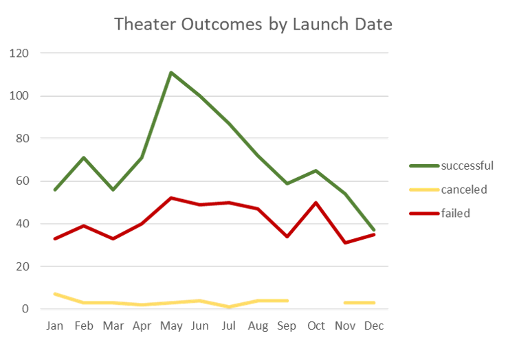
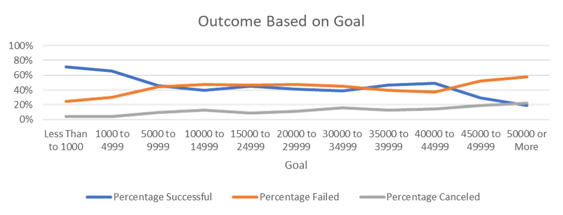
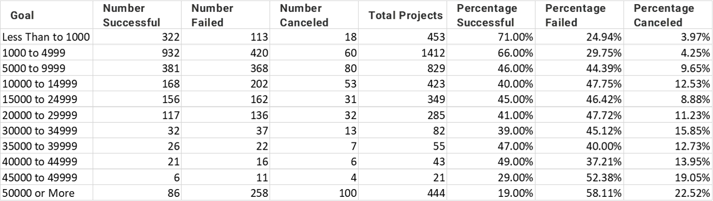

# UCF_Demo_Excel_Kickstarter_Challenge
Demo of Excel Kickstarter_Challenge

# Kickstarting with Excel

## Overview of Project

### Purpose

## Analysis and Challenges

### Analysis of Outcomes Based on Launch Date

* Good months to launch a theater project in Kickstarter are May, June, July

### Analysis of Outcomes Based on Goals

* Kickstarter projects with a goal of $5,000 or less are the most successful.
* Note the most common project funding raising goal is between $1,000 and $5,000.

### Challenges and Difficulties Encountered

## Results

- What are two conclusions you can draw about the Outcomes based on Launch Date?

- What can you conclude about the Outcomes based on Goals?

- What are some limitations of this dataset?

- What are some other possible tables and/or graphs that we could create?
